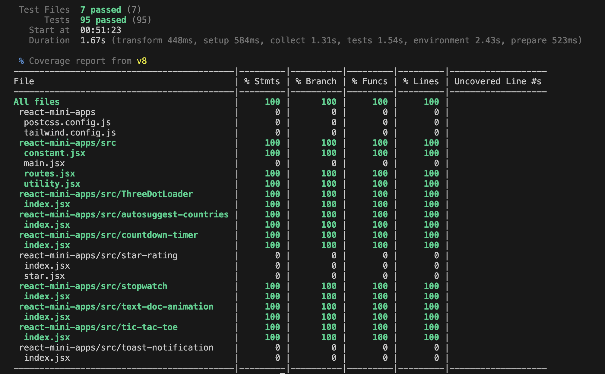
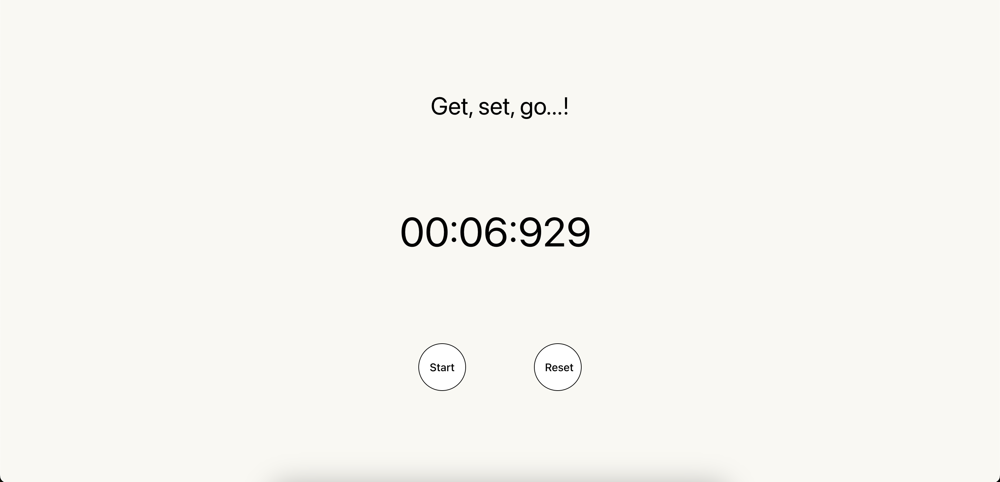
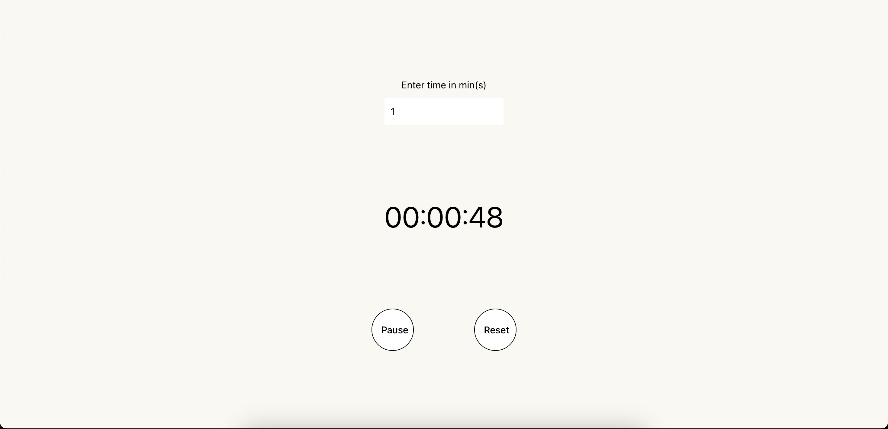
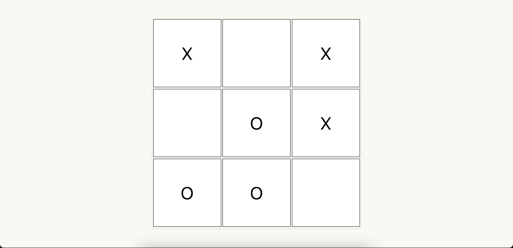
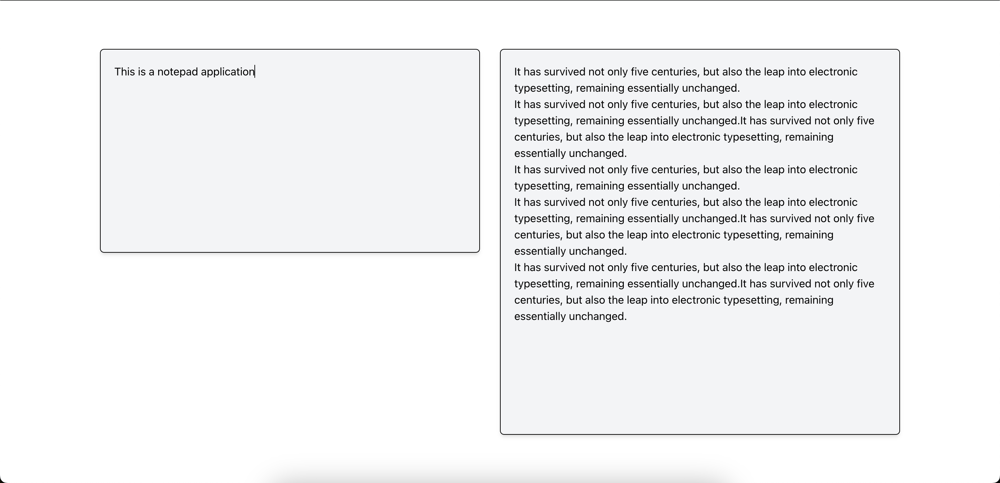
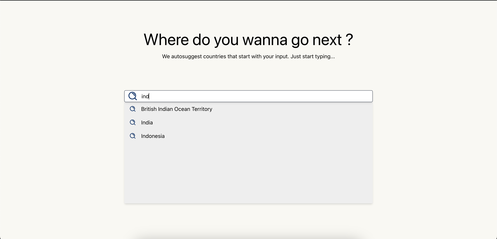

# Testing Suite - for React apps

Try yourself: 

[Coverage Report](https://triedwhatnot.com/projects/react-testing-suite/coverage-report)

[Live App Demo](https://triedwhatnot.com/projects/react-testing-suite/home)


## Description
Aimed to come up with testing modules targeting Functional and Regression testing for various components of this React app, we have written 90+ test cases, covering Unit Testing, Integration Testing and E2E testing for these 5 apps - Stopwatch, Countdown timer, Tic-Tac-Toe, Notepad, Auto-complete countries.

These test cases have led to 100% coverage, making sure that each line of code (LOC) has been tested.





## Tech stack
1. React
2. Vite
3. Vitest (similar to Jest) - JS test runner
4. React Testing library
5. Jest DOM - helper functions library for easier assertions
6. JS-DOM - browser like environment
7. Tailwind CSS


## Learnings
1. Using Vitest instead of Jest with Vite is a better choice, as it is relatively easy to configure, because of duplication in underlying code among Jest and Vite. Also, it:
    - offers similar assertions and helper functions as Jest, making it easier to migrate from Jest to Vitest
    - can use same configuration file as vite.config.js
    - provides Vitest UI, which can be used to visualise and track tests in a very representative way

2. A test case usually comprises of 3 parts: Rendering, Querying and Assertion.

3. Roles for different HTML elements to use in getByRole:
    ```
    - button -> button
    - anchor -> link
    - h1 to h6 -> heading
    - img -> img
    - button -> button
    - form -> form
    - input text -> textbox
    - input checkbox -> checkbox
    - input radio -> radio
    - input number -> spinbutton
    - select -> combobox
    - li -> listitem
    ```

4. setTimeouts and setIntervals can be mocked and controlled using these methods:
    ```
    - vi.useFakeTimers()
    - vi.advanceTimersByTime(2)
    - vi.runAllTimers()
    - vi.advanceTimersToNextTimer()
    - vi.advanceTimersByTime(2000)
    - vi.restoreAllMocks()
    ```

5. A typical beforeEach and afterEach function could look like: 
    - beforeEach
        ```
        beforeEach(() => {
            vi.useFakeTimers();
        });
        ```
    - afterEach
        ```
        afterEach(() => {
            vi.resetAllMocks();
            vi.unstubAllGlobals();
            cleanup();
        });
        ```

6. act method - It's responsible for flushing all effects and re-renders after invoking it.

7. Mocking window.alert
    ```
    vi.stubGlobal("alert", vi.fn((arg) => arg));

    const alertSpy = vi.spyOn(window, 'alert');

    expect(alertSpy).toHaveBeenLastCalledWith('Player 1 won!! Restart Game?');
    expect(alertMock).toHaveBeenCalledTimes(1);
    ```

8. Mocking window.fetch - you need to get a new instance of function always before stubbing any global (unstopGlobals seems to delete all instances prior used)
    ```
    const getMockedFetchQuery = (data) => {
        return vi.fn(() => {
            return Promise.resolve({
                json: () => {
                    return new Promise(res => {
                        setTimeout(()=>{
                            res(data);
                        },1000);
                    });
                }
            })
        });
    }
    vi.stubGlobal("fetch", getMockedFetchQuery(IN_MOCK_DATA));
    ```


9. Simulate click, keyDown, change events as:
    ```
    fireEvent.click(testBoxArr[0]);
    fireEvent.change(inputEl, { target: { value: "First line of dummy input" }});
    fireEvent.keyDown(inputEl, { key: "Enter" });
    ```

10. Assertion for a styling could look like:
    ```
    expect(textUnitsArr[0]).toHaveStyle("animation: bg-fade-out 1 2s ease-in-out;");
    ```

11. Ignore coverage for particular lines by: 
    ```
    /* v8 ignore start */
        code to be ignored
    /* v8 ignore stop */
    ```

12. Router testing can be done through memoryRouter / createMemoryRouter


## Snapshots

1. Stopwatch




2. Countdown timer




3. Tic-Tac-Toe




4. Notepad app




5. Auto-complete countries



